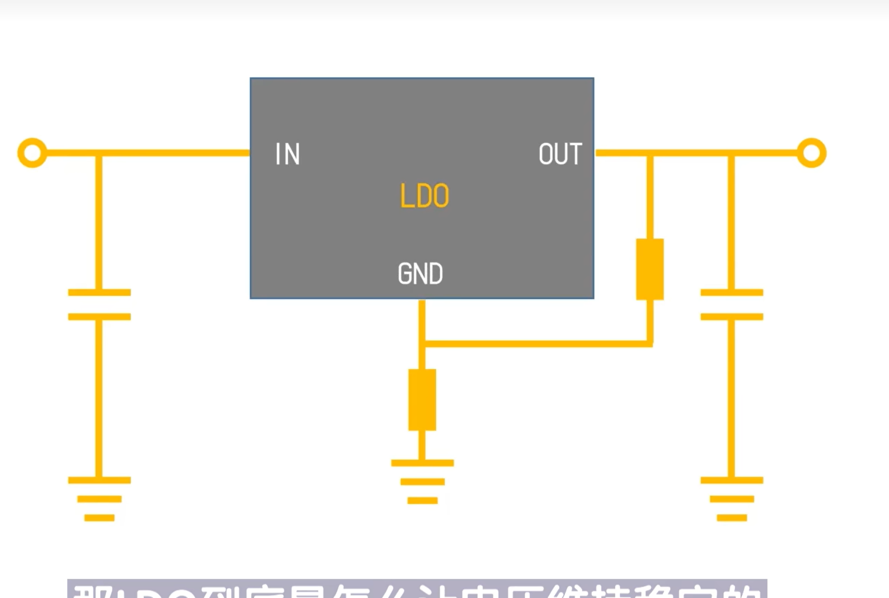
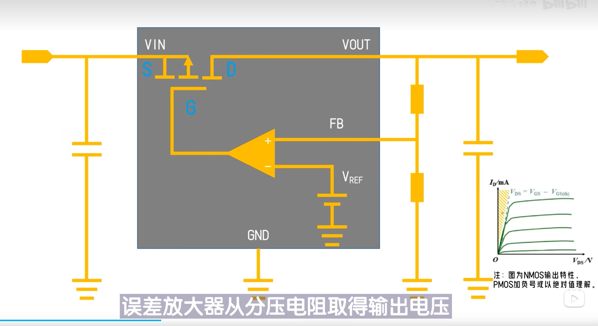

# LDO低压差线性稳压源  
低压差：输入输出压差较低  
线性：内部MOS管工作在线性区  
稳压器：提供稳压电源  

  

重要参数：  
1. 输入输出压差  
$V_{in}-V_{out}$，必须大于最小压差才能正常工作，压差越小，效率越高  
2. 电源纹波抑制比PSRR  
$PSRR = 20 \log_{10} (\frac{V_{ripple\_in}}{V_{ripple\_out}})$，单位 dB。衡量对输入纹波的抑制能力。高频 PSRR 主要取决于输出电容。 
3. 结温特性 $T_j$  
$T_j = T_a + (V_{in} - V_{out}) \cdot I_{out} \cdot R_{\theta JA}$。芯片内部最高允许温度（通常 $125^\circ C$）。大压差大电流下需严防过温保护（OTP）。  
4. 静态电流 $I_q$  
无负载时 LDO 自身的功耗。低功耗设计（如电池供电）需重点关注。  
5. 输入输出电容  
**输入电容 $C_{in}$**：靠近引脚放置，补偿输入线感抗，抑制瞬态跌落。  
**输出电容 $C_{out}$**：**稳定性核心**。必须满足手册要求的 **ESR 范围**（稳定性隧道）。  
>**ESR 过低**：零点频率过高，无法补偿内部极点，导致高频振荡。  
**ESR 过高**：瞬态响应变差，纹波增大。  
**选型建议**：老款 LDO（如 1117）常配合 **钽电容**（ESR 适中）；新款 LDO 标注 "Stable with Ceramic" 则可直接用陶瓷电容MLCC。  

> [参考视频1]( https://www.bilibili.com/video/BV1944y1U7Ra/?share_source=copy_web&vd_source=81a887c55318abdb4a86a507aef052ac)  
> [参考视频2](https://www.bilibili.com/video/BV1XhApz3EWv?spm_id_from=333.788.videopod.sections&vd_source=344923b6d8ec4074946a9e08f5eddd16)

