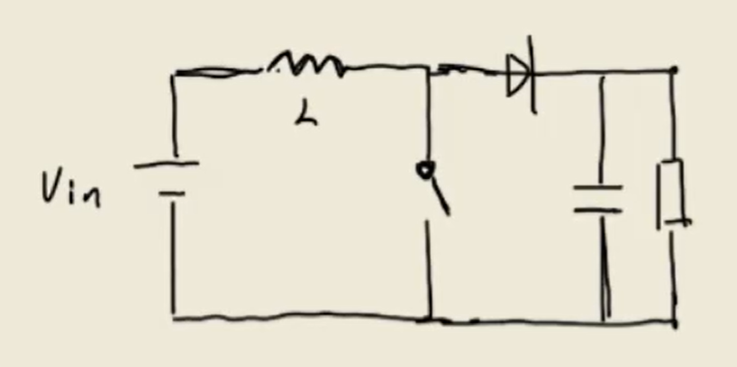

# boost升压电路  
  

## 1. 基本参数
- **占空比 $D$**：开关闭合时间与周期的比值。
- **周期 $T$**：开关切换的一个完整周期。
- **输出电压公式**：$$V_{out}=\frac{1}{1-D}V_{in}$$

## 2. 工作原理（CCM模式）
Boost电路通过电感的“泵感”作用实现升压：
1. **充电阶段（开关ON）**：电感 $L$ 接通 $V_{in}$，电流线性增加，电感储能。此时二极管截止，负载由电容供电。
2. **放电阶段（开关OFF）**：电感电流不能突变，产生感应电动势与 $V_{in}$ 叠加，通过二极管向负载供电并给电容充电。

## 3. 伏秒平衡 (Volt-Second Balance)
处于稳定状态下的电感，在一个周期内磁通变化量为零。
- **公式**：$V_{on} \cdot t_{on} = V_{off} \cdot t_{off}$
- **推导**：$V_{in} \cdot DT = (V_{out} - V_{in}) \cdot (1-D)T$
- 从而得出：$V_{out} = \frac{1}{1-D}V_{in}$

## 4. 关键设计公式
- **电感电流纹波**：$\Delta I_L = \frac{V_{in} \cdot D}{f \cdot L}$
- **输出电压纹波**：$\Delta V_{out} = \frac{I_{out} \cdot D}{f \cdot C}$
- **临界电感值**：$L_{crit} = \frac{R \cdot D(1-D)^2}{2f}$（保证进入CCM模式）

## 5. 电赛注意事项
1. **二极管**：必须选用**肖特基二极管**（低压降、高速度）。
2. **电感**：注意**饱和电流**，电感量过小会导致纹波过大或进入DCM模式。
3. **布局**：功率回路（电感-开关-二极管-电容）要尽可能短，减小寄生电感。
